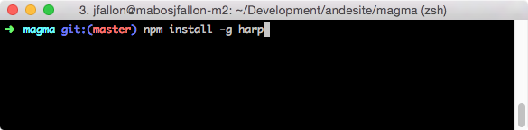
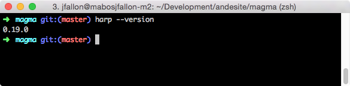
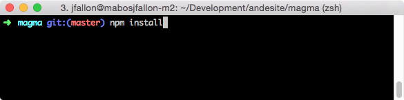
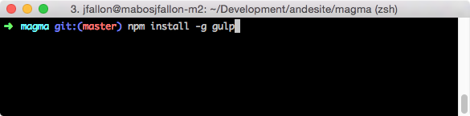
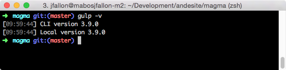
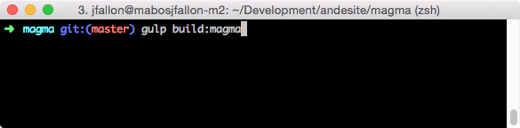
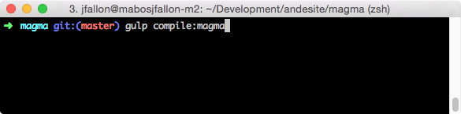

# Cengage Magma - Beta version 0.7

## The short version
#### 1. Open a terminal window.
#### 2. Run `npm install` to install the developer dependencies.
#### 3. Run `npm install -g gulp` to install the world-famous Gulp task runner.
#### 4. Run `gulp build:magma` to build your Magma CSS  
#### 5. Run `npm install -g harp` to install the Harp web server.
#### 6. Run `gulp serve:magma` to display the documentation at [http://localhost:9000](http://localhost:9000).
#### 7. Run `gulp compile:magma` to generate a static version of the documentation. The static documentation version can be found at /static.

 
## Install, Build, View and Compile Magma on your local machine

In order to view the Cengage Magma documentation as a stand-alone website in your local machine, you will have to have the following installed:

1. Node.js
2. Harp.js

### Installing Node.js

Node.js is a platform built on Chrome's JavaScript runtime for easily building fast, scalable network applications.

Navigate over to [nodejs.org](http://nodejs.org/) and click the installer button or follow the [Downloads](http://nodejs.org/download/) link in case you cannot locate the right version of Node required for your machine.

Once you have installed Node.js and verified that your installation is working properly via the command line by typing `node --version` (it should return a version number like 'v0.12.0'), you will need to install Harp.js via NPM, the Node Package Manager installed along with Node.js.

If you are unable to install Node.js, please consult the [documentation](https://github.com/joyent/node/wiki/installing-node.js-via-package-manager)

### Installing Harp.js

#### 

Harp.js is a static web server with built-in preprocessing for serving Jade, Markdown, EJS, CoffeeScript, Sass, LESS and Stylus as HTML, CSS & JavaScript files.

Fire up the command line again and type `npm install -g harp`. This command should take a moment to install all of the packages required to run Harp.js locally. Once that is done installing, verify that everything is working properly by typing `harp --version` on the command line which should return a number like '0.19.0'.

#### 

If your installation did not go smoothly or you are unable to run Harp.js, please consult the [documentation](http://harpjs.com/docs/).

### Installing Dependencies

#### 

Certain dependencies must be installed in order for Magma to run properly and this can be easily accomplished by running `npm install` from the command line. It should only take a moment.

### Installing Gulp

#### 

Magma uses [Gulp](http://gulpjs.com) for building; to install it, first run `npm install -g gulp`. Once installed, verify that everything is working properly by typing `gulp -v` 

#### 

which should return a number like '3.9.0' for both the CLI and Local versions.

### Building Magma

#### 

To build Magma, run `gulp build:magma`; to compile with a skin, run `gulp build:magma --skin <skin>`. Your skinned, minified CSS file will be in the build folder.

### Serving Magma

#### 

Magma can be served up locally by running `gulp serve:magma` from the command line inside the `/magma` folder. This will start up the harp.js server and tell the user on the command line which port is in use, generally at [http://localhost:9000](http://localhost:9000).

Harp.js listens by default on port 9000, so if you have a any other application running on that port, just modifying the start command to `harp server --port <port>` will alleviate the congestion and allow you to run Harp.js with no issues.

### Compiling Magma

#### 

In the case that you would like to compile the Magma documentation website and view it locally, run `gulp compile:magma` from the command line and a static version of the website will be accesible from the `/static` folder. This version does not require Harp.j but does require you to build Magma first via the command line by running `gulp build:magma`.
